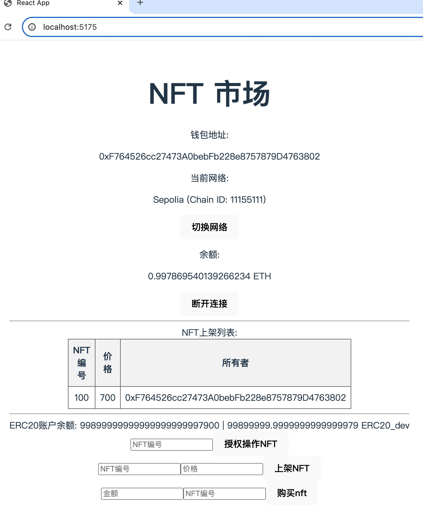

# TokenBank应用
- nft_onlist.png 为NFT上架后的截图

```
DApp 接入 AppKit 登录
为 NFTMarket 项目添加前端，并接入 AppKit 进行前端登录，并实际操作使用 WalletConnect 进行登录（需要先安装手机端钱包）。
并在 NFTMarket 前端添加上架操作，切换另一个账号后可使用 Token 进行购买 NFT。
提交 github 仓库地址，请在仓库中包含 NFT 上架后的截图。
```
